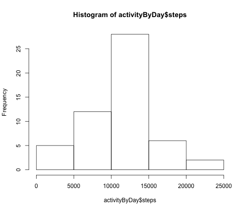
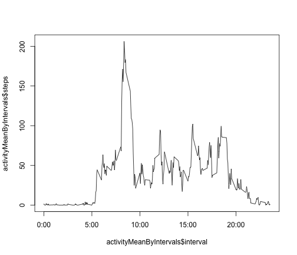
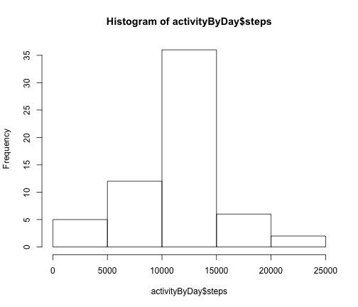
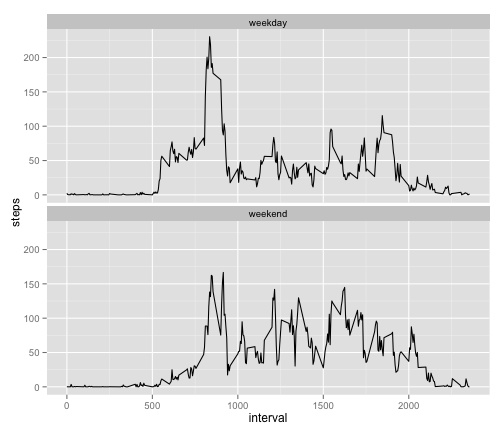

# Reproducible Research: Peer Assessment 1


## Loading and preprocessing the data

```r
library(plyr)
library(reshape2)
activity <- read.csv("activity.csv")
activityClean <- activity[!is.na(activity$steps),]
```


## What is mean total number of steps taken per day?
Total Steps Per Day:

```r
activityByDay <- ddply(activityClean, .(date), numcolwise(sum))
hist(activityByDay$steps)
```

 

Mean Total Steps Per Day:

```r
mean(activityByDay$steps)
```

```
## [1] 10766
```

Median Steps Per Day:

```r
median(activityByDay$steps)
```

```
## [1] 10765
```

## What is the average daily activity pattern?

```r
activityMelt <- melt(activityClean, id=c("interval"), measure.vars=c("steps"))
activityMeanByIntervals <- dcast(activityMelt, interval ~ variable, mean)
plot(activityMeanByIntervals$interval, activityMeanByIntervals$steps, type="l", xaxt="n")
axis(1, labels = c('0:00', '5:00', '10:00', '15:00', '20:00'), at = c(0, 500, 1000, 1500, 2000))
```

 

5-minute interval with maximum number of steps:

```r
activityMeanByIntervals[activityMeanByIntervals$steps == max(activityMeanByIntervals$steps),][1]
```

```
##     interval
## 104      835
```


## Imputing missing values
Total number of missing values in the dataset:

```r
activityNAs <- activity[is.na(activity$steps),]
nrow(activityNAs)
```

```
## [1] 2304
```

Calculating and filling in the NA values using the mean values for the 5-minute interval:

```r
fn <- function(x) activityMeanByIntervals[activityMeanByIntervals$interval == x, 2]
imputedMean <- ddply(activityNAs, ~ date, transform, steps = fn(interval))
```
Create a new dataset with the missing values filled in:

```r
activityWithoutNAs <- rbind(activityClean, imputedMean)
```
Total Steps Per Day:

```r
activityByDay <- ddply(activityWithoutNAs, .(date), numcolwise(sum))
hist(activityByDay$steps)
```

 

Mean Total Steps Per Day:

```r
mean(activityByDay$steps)
```

```
## [1] 10766
```

Median Steps Per Day:

```r
median(activityByDay$steps)
```

```
## [1] 10766
```
Conclusion: 
After imputing the missing values based on the above results the mean is the same value as calculated by removing NAs in the part 1 above and the median is now the same value as the mean with not much difference between the 2 datasets

## Are there differences in activity patterns between weekdays and weekends?
Creating a new factor variable by converting all dates to either a weekday or weekend level

```r
activityWithoutNAs$day <- weekdays(as.Date(activityWithoutNAs$date))
weekdaysList <- c("Monday", "Tuesday", "Wednesday", "Thursday", "Friday")
fn <- function(x) ifelse ((x %in% weekdaysList), "weekday", "weekend")
activityWeekdays <- ddply(activityWithoutNAs, ~ date, transform, day = fn(day))
activityWeekdays$day <- factor(activityWeekdays$day)
```

Panel Plot:

```r
library(ggplot2)
activityDataByWeekday <- aggregate(steps~day+interval, data=activityWeekdays, mean)
g <- ggplot(activityDataByWeekday, aes(interval, steps))
g + geom_line() + facet_wrap(~ day, nrow=2, ncol=1)
```

 
